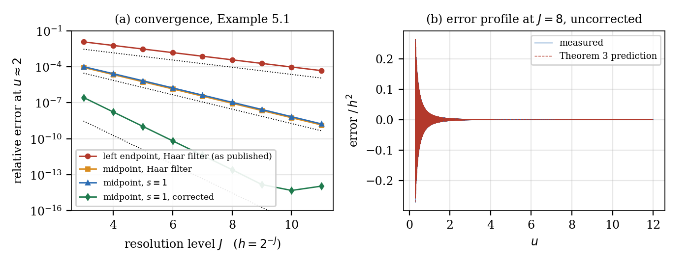

# hfgs — half-shifted Fourier inversion for Gerber–Shiu functionals

Fast, fourth-order computation of **finite-horizon Gerber–Shiu expected discounted
penalty functions** for spectrally negative Lévy processes — one FFT returns the
whole grid in the initial condition.

```
X_t = u + c·t + σB_t − L_t,    τ = inf{t : X_t < 0}
ξ(u) = E_u[ e^{−δτ} κ(X_{τ−}, |X_τ|) · 1{τ < ∞} ]
```

The same object is finite-time ruin, first-passage default with overshoot-dependent
recovery, and transient overflow of a storage system. This repository is the
reference implementation for the paper in [`paper/`](paper/paper.pdf).

<p align="center">
  
</p>

## What's the idea

The published wavelet–FFT scheme this work builds on is first order. It turns out
it is not computing a Haar projection at all — it evaluates a *filtered,
half-shifted, band-limited inverse Fourier integral*

$$A_m[s] \;=\; \frac{1}{2\pi}\int_{|\omega|\le\pi/h}\hat\xi(\omega)\,
e^{i\omega x_{m+1/2}}\,s(\omega h)\,\mathrm{d}\omega,
\qquad x_{m+1/2}=(m+\tfrac12)h .$$

Two consequences, neither of which costs an extra flop:

1. **Read the output at cell midpoints, not at nodes.** The causal extension of ξ
   jumps at the origin, and the resulting Gibbs oscillation is `cos(Ωx)` to leading
   order. Midpoints sit at `Ωx = π(m+½)` — exactly its zeros — so the leading term
   cancels and the error drops from `Θ(h)` to `O(h²)`.
2. **Drop the Haar filter (`s ≡ 1`) and subtract a two-term corrector** built from
   `ξ(0⁺)` and `ξ'(0⁺)`, both of which the transform supplies in closed form. That
   removes the remaining `O(h²)` terms and gives **fourth order**.

Measured relative error at `u ≈ 2` on the classical `λ=20, Exp(1), c=25` example:

| J | node, Haar (as published) | midpoint, Haar | midpoint, `s≡1` | **corrected** |
|---:|---|---|---|---|
| 4  | 6.21e−03 | 2.27e−05 | 2.72e−05 | **1.71e−08** |
| 6  | 1.56e−03 | 1.43e−06 | 1.75e−06 | **6.55e−11** |
| 8  | 3.91e−04 | 8.98e−08 | 1.10e−07 | **2.54e−13** |
| 10 | 9.77e−05 | 5.62e−09 | 6.88e−09 | **4.66e−15** |
| order | 1 | 2 | 2 | **4** |

Reaching `1e−9` needs `J = 12` (4096 points per unit) uncorrected, and `J = 6`
(64 points per unit) corrected — a **64× reduction in grid density**.

## Install

```bash
git clone https://github.com/NoEdgeAtLife/hfgs.git
cd hfgs
pip install -e .            # or: pip install -r requirements.txt
```

Python ≥ 3.10, NumPy, SciPy. Matplotlib only for the figures. No compiled
extensions, no multiprecision arithmetic — everything runs in IEEE double on one
core.

## Quickstart

```python
from hfgs import SNLP, grid_scheme, midpoints, finite_horizon

# X_t = u + ct + sigma B_t - L_t, with L a Poisson(lam) subordinator whose
# severities are a mixture sum_i w_i Exp(b_i), optionally capped at M.
mod = SNLP(c=25.0, lam=20.0, w=[1.0], b=[1.0], sigma=0.0)

rho = mod.phi(0.0)                              # Lundberg root: psi(rho) = delta
bd  = tuple(mod.boundary_data(0.0, rho, K=2))   # (xi(0+), xi'(0+)), from the transform

xi  = grid_scheme(lambda z: mod.Lxi(z, 0.0, rho),
                  J=8, N=1 << 18,               # h = 2^-J, N cells
                  filt="shannon", corr=bd)      # <- the fourth-order scheme
u   = midpoints(8, 1 << 18)                     # values live at (m+1/2)*h

# finite horizon: the whole ruin-probability ladder at t = 10, one call
psi_t = finite_horizon(mod, t=10.0, J=6, N=1 << 18)
```

Two free exactness checks that cost nothing and catch almost every mistake:

```python
mod.Lw(rho) / mod.c                             # = xi(0+)   -> 0.8
mod.Lxi([0j], 0.0, rho)[0].real                 # = int xi   -> 4.0
```

### Gotchas

Two mistakes each cost **two orders of convergence**:

- Values live at **midpoints** `(m + 1/2)·2^−J`, *not* at `m·2^−J`. Reading them at
  nodes is precisely the `Θ(h)` error the whole method is designed to avoid.
- At **complex** discount rates (i.e. at every Bromwich node inside
  `finite_horizon`) the boundary data is complex. Do not take real parts before
  passing it to `corr`.

## API

| symbol | purpose |
|---|---|
| `SNLP(c, lam, w, b, sigma=0, M=inf)` | the model; severities `sum_i w_i Exp(b_i)`, capped at `M` |
| `.psi(z)`, `.A(z)`, `.Lw(z, kappa)` | Laplace exponent, jump exponent, penalty transform |
| `.phi(delta, rho0=None)` | Lundberg root, valid for complex `delta`, no safety loading needed |
| `.Lxi(z, delta, rho, kappa)` | the master transform (Thm 3.1), incl. the creeping term for `sigma > 0` |
| `.boundary_data(...)` | `(ξ(0⁺), ξ'(0⁺), …)` by Richardson extrapolation of `z·Lξ(z)` |
| `grid_scheme(Lxi, J, N, filt, corr)` | one FFT → the whole midpoint grid |
| `midpoints(J, N)` | the grid the values live on |
| `finite_horizon(model, t, J, N, ...)` | Abate–Whitt Euler inversion of `Lξ(·;δ+s)/s` |
| `dLxi`, `dLxi_dc`, `dLxi_dlam` | exact parametric sensitivities (Thm 7.1) |
| `boundary_from(Lfun, K)` | boundary data of *any* transform — needed to differentiate the corrector |
| `euler_invert`, `gaver_digits`, `threshold` | utilities |

**Filters.** `filt="shannon"` is `s ≡ 1` (recommended); `"haar"` is
`s = (θ/2)/sin(θ/2)`, the published scheme; `"cell"` is `s = sinc(θ/2)`, cell averages.

**Penalties.** `kappa=("ruin",)` is κ ≡ 1; `("power", n)` is κ = yⁿ; `("expo", a)` is
κ = e^{−ay}. Gerber–Shiu is linear in κ, so scale the output for κ = c·e^{−ay}.

## Repository layout

```
hfgs/
├── hfgs/
│   ├── __init__.py
│   └── core.py               the whole method, ~400 lines
├── experiments/              reproduces every table and figure in the paper
│   ├── convergence.py        convergence orders 1/2/2/4; error-formula ratios
│   ├── validation.py         delta>0 with kappa=y^3; Gaussian component vs scale
│   │                         functions; finite horizon vs Prabhu; Gaver-Stehfest
│   ├── credit.py             first-passage default, overshoot recovery, Monte Carlo
│   ├── serving.py            LLM serving capacity, offload frontier, gradients
│   ├── sensitivities.py      exact Greeks vs closed forms and central differences
│   ├── atoms.py              kinks induced by an atom in the Levy measure
│   └── make_figures.py       figures 1-3
├── figures/                  generated PNGs (committed)
├── data/                     intermediate .npy arrays (gitignored)
└── paper/
    ├── paper.tex
    └── paper.pdf
```

## Reproducing the paper

Scripts are runnable directly (they bootstrap `sys.path`) or after `pip install -e .`.
Single-core timings in brackets.

```bash
python experiments/convergence.py      # Tables 6.1-6.2            [~4 min]
python experiments/validation.py       # Table 7.2, Sec. 6-7       [~3 min]
python experiments/sensitivities.py    # Sec. 8                    [~1 min]
python experiments/atoms.py            # Remark 5.5                [~2 min]
python experiments/credit.py           # Table 9.1, Sec. 9         [~4 min]
python experiments/serving.py          # Table 10.1, Sec. 10-11    [~5 min]
python experiments/make_figures.py     # Figures 1-3               [~2 min]
```

`make_figures.py` reads arrays written by `credit.py` and `serving.py` into `data/`,
so run those two first.

Rebuild the paper with:

```bash
cd paper && pdflatex paper.tex && pdflatex paper.tex
```

## Selected results

**Credit.** Recovery driven by the overshoot at default, `κ(x,y) = (1−α)e^{−y}`, is a
genuine Gerber–Shiu penalty — a diffusion model has no overshoot and therefore no
recovery *term structure* at all. Validated against unbiased Monte Carlo (exact
simulation, 4×10⁶ paths); every discrepancy falls inside one standard error on both
the default and the recovery leg. The whole leverage ladder costs 31 µs per point.

**Serving.** By Asmussen's duality the finite-horizon ruin probability *is* the
transient backlog-overflow probability of a queue, so one FFT gives the entire
buffer ladder. An offload threshold is excess-of-loss reinsurance verbatim, atoms
and all. Because the finite-horizon theory needs no safety loading, the
**transiently overloaded** regime (utilisation > 1, where perpetual theory returns
the useless constant 1) stays computable: at utilisation 1.036, `P(backlog ≥ 60 ktok)`
is 0.115 over a 5 s burst and 0.843 over 60 s.

**Differentiability.** The scheme is linear in `ξ̂`, so differentiate-then-discretise
and discretise-then-differentiate coincide exactly, and an adjoint returns a full
gradient in `O(N log N + dN)`. One caveat worth repeating: differentiating the
corrector is what preserves the rate — with it, gradients agree with a Richardson
reference to 2.4e−8; without it, 2.3e−4.

## Citing

```bibtex
@misc{hfgs,
  title  = {Half-shifted {F}ourier inversion for finite-horizon {G}erber--{S}hiu
            functionals: fourth-order accuracy at first-order cost, exact
            sensitivities, and applications to credit, capacity planning and
            differentiable design},
  year   = {2026},
  note   = {Software and paper: \url{https://github.com/NoEdgeAtLife/hfgs}}
}
```

## Scope and limitations

- Fourth order needs ξ ∈ C⁴ on (0,∞) with integrable fourth derivative.
  Infinite-activity models with a logarithmic singularity at the origin (a
  Lévy–Gamma subordinator, say) break that; midpoint second order survives, but the
  corrector must be enriched.
- Finite-horizon accuracy is capped at ≈1e−9 relative by the Laplace inversion, so
  refining beyond `J ≈ 5` buys nothing in `t`.
- Probabilities below ≈1e−11 are not resolvable in double precision; bracket
  root-finding on signs, not logarithms.
- Within one or two cells of a kink induced by an atom of ν the order degrades to one.
- Severities are mixtures of exponentials (dense in the positive severities, closed
  under capping). Nothing in the theory depends on that — another family needs only
  its own `A(z)` and `Lw(z)`.

## License

MIT — see [`LICENSE`](LICENSE).
